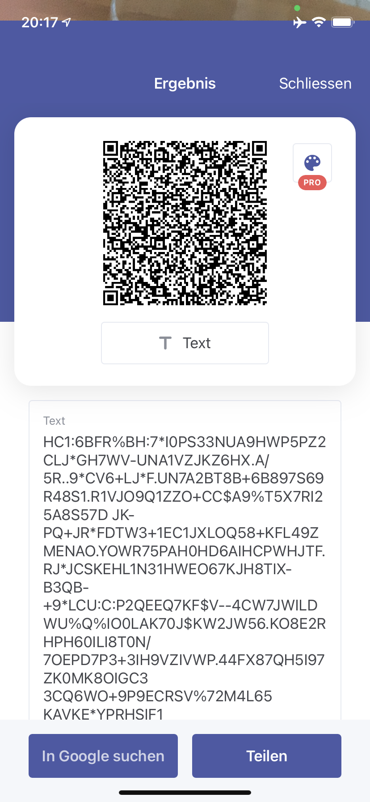

Inspired by the following links:

- https://github.com/ehn-digital-green-development/hcert-spec
- https://github.com/ehn-digital-green-development/ehn-sign-verify-python-trivial
- https://github.com/eu-digital-green-certificates/dgc-testdata
- https://github.com/Digitaler-Impfnachweis/certification-apis
- https://github.pathcheck.org/debug.html
- https://dgc.a-sit.at/ehn/

Technological base mechanism:

Use as follows to validate:

    cat demo-token.b45 | xargs python3 ./hc1_verify.py --cert demo-dsc.crt --token

    Decoding und Validating your token with given certificate...
    ---------------------------------------------------------------------------------------------
    {
        "1": {
            "dob": "1964-08-12",
            "nam": {
                "fn": "Mustermann",
                "fnt": "MUSTERMANN",
                "gn": "Erika",
                "gnt": "ERIKA"
            },
            "t": [
                {
                    "ci": "URN:UVCI:01DE/IZ12345A/5CWLU12RNOB9RXSEOP6FG8#W",
                    "co": "DE",
                    "dr": "2021-05-30T10:30:15Z",
                    "is": "Robert Koch-Institut",
                    "sc": "2021-05-30T10:12:22Z",
                    "tc": "Testzentrum K\u00f6ln Hbf",
                    "tg": "840539006",
                    "tr": "260415000",
                    "tt": "LP217198-3"
                }
            ],
            "ver": "1.0.0"
        }
    }
    ---------------------------------------------------------------------------------------------
    Issuer: DE
    Issued At: 29.05.2021, 19:21:13
    Experation time: 28.01.2022, 07:47:53
    Is valid: True
    ---------------------------------------------------------------------------------------------
    
Data from sample QR-Code:
<table>
  <tbody>
    <tr>
      <td></td>
      <td></td>
    </tr>
  </tbody>
</table>

